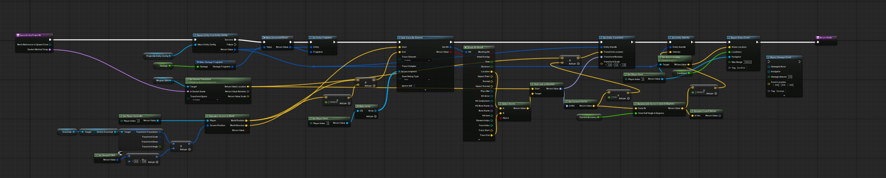
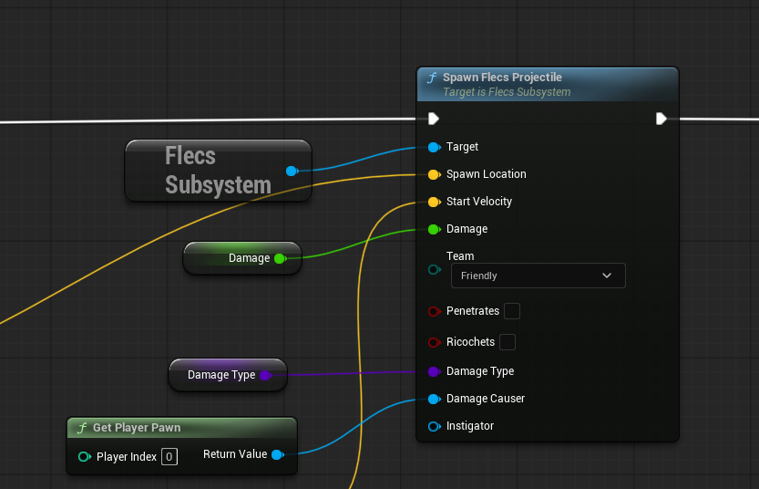

In the previous post, I proved Data-Oriented Design could simulate 100,000+ projectiles without melting the CPU. But Unreal’s Mass Entity framework came with suffocating boilerplate. I needed that same DOD performance, but with an API that didn't fight me or other teammates if they ever felt the need to expose more functionality.

I ripped Mass out entirely and integrated FLECS, a lightweight C/C++ ECS. I replaced dozens of Unreal asset files with about 150 lines of clean code. FLECS is widely used across the industry as a method to implement ECS without building it from scratch. For our case, the actual flow of interacting with Mass was just intuitive. Individual Data assets had to be made for each projectile, Data was stored in fragments which function as Structs making data retrieval and sending super messy, and on top of that Mass is so fragile that hit events were communicated using Interface events that couldn’t simple inherit from parents, but had to be implemented for every single actor in the game. But shoving a third party C++ library into Unreal Engine 5 led me to a few bugs, like Niagara only accepting 32 bit Particle IDs, with FLECS using 64 bit. The same In-Frame latency also came up, which was thankfully fixed in a very similar way so didn’t require too much trial and error and then on top of that I had a funky Garbage Collector crash that had to essentially validate whether a FLECS value still existed or not before purging,

The spawn code alone went from this:

  
  

    *Query used by medium range enemies.*
  

To this!

  
  

    *Query used by medium range enemies.*
  

The actual code that needed to be written is a single Subsystem!!!!! It’s made our lives so much easier and allowed us to send more “traditional” projectile data. Objects like Damage Causers and Instigators and even Damage Types were easily send across using Weak Pointers so the Multi-threading remained stable, and time Niagara had no issues assigning Particle ID’s! This Projectile Saga is easily the most complex system I’ve ever worked with, and I still feel like the rest of the industry is using something that’s even beyond this. But for now, FLECS will be more than enough to serve our needs!