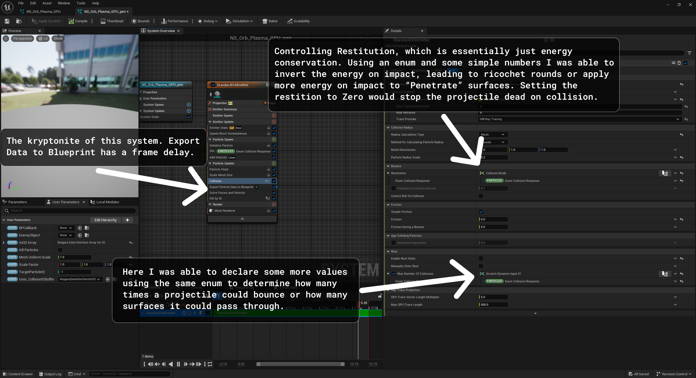
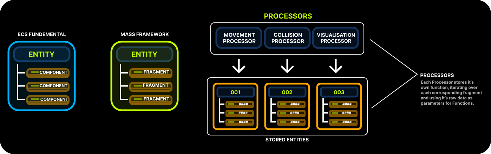

During some research and development at the start of the academic year, I needed to simulate thousands of active projectiles with collision, ricochets, penetration, and team affiliation all while sending enough info to a Niagara system that allows for variation.

In this post, I want to talk about the journey of achieving this in UE5 (and the pain it caused). I’ll cover why standard Actors buckle under the weight, why pure Niagara is limiting, and how I solved the problem by building a multi-threaded ECS (Entity Component System) using Epic's Mass Framework, along with the brutal visual bugs I had to overcome to get there.

I wrote a full dissertation where I break down the results of the benchmarks in way more detail which you can read below or through this link: https://drive.google.com/file/d/16Td_qokedhmdSj0rU0_FCwcCKTpfwWnB/view?usp=sharing

<iframe src="https://drive.google.com/file/d/16Td_qokedhmdSj0rU0_FCwcCKTpfwWnB/preview" width="100%" height="640" allow="autoplay"></iframe>

## Attempt 1: Actor based

### The Approach:
The standard Unreal object oriented way. You create a BP_Projectile Actor with a ProjectileMovementComponent and spawn one for every bullet.

### Why it failed:
Actors can be heavy, and Object-Oriented Programming is not hardware sympathetic. Every AActor comes with massive overhead including UObject tracking, garbage collection polling, transform hierarchies, and virtual function ticks.

In my benchmarking, the Actor system failed completely at 160,500 projectiles, locking up the CPU with a frame time of over 19 seconds (~0.05 FPS). The memory footprint was equally disastrous, consuming over 5.3 GB of RAM, roughly 27KB per projectile. Furthermore, because the frame rate tanked, the collision detection suffered from severe "tunneling" (temporal aliasing), dropping to a dismal 3.75% collision accuracy at just 25,000 entities. In retrospect, the tunnelling could’ve probably been fixed with CCD enabled on their collision spheres, but that would have exponentially added to the frame time, and I wasn’t about to let my computer suffer any more.

### The Outcome:
Great for rocket launchers and anything that needed real physics. Terrible for miniguns and bullet hells. We were hitting a "Cache Wall" where the CPU spent more time fetching fragmented object memory from RAM than doing actual math.

This was our primary implementation that we used for a long time, but we didn’t really notice the performance until we scaled up the action.

## Attempt 2: Niagara

### The Approach:
Ditch the CPU Actors entirely. Do the math in Niagara and let the GPU render the bullets and handle collisions using raytracing. Signed Distance Field Collisions were also an option but our environment and characters had geometry that was too small and too detailed to consistently generate clean SDFs leading to very inconsistent collisions between each time the game was launched. Probably could have got around this with baked SDFs but that’s something I didn’t really have the experience or time to mess around with, so Raytracing it is!

### Why it failed:
While rendering arrays in Niagara is incredibly fast, processing 250,000 particles in just ~4.3ms, doing complex gameplay logic is a nightmare.

Niagara likes to operate as a walled off simulation. Because the GPU simulation runs asynchronously from the CPU Game Thread, by the time the GPU reports a collision back to the CPU, the game state has already moved on. In my collision accuracy benchmarks, Niagara peaked at a completely nonviable 6.08% accuracy, frequently dropping to 0%. This was such a killer. And sadly this method for communication was bound by hardware, since the physical PCIE lane can’t send data in two directions in a single frame. Again, a custom HLSL solution within niagara modules would’ve probably done it, but that kind of functionality with HLSL is beyond my current capabilities.

### The Outcome:
Perfect for sparks and rain. Functionally useless for registering reliable gameplay events like damage and ricochets.

## Attempt 3: Multi-threaded ECS 
<iframe width="600" height="400" src="https://www.youtube.com/embed/uqNshaHhEa0" title="Raw Gameplay" frameborder="0" allow="accelerometer; autoplay; clipboard-write; encrypted-media; gyroscope; picture-in-picture; web-share" referrerpolicy="strict-origin-when-cross-origin" allowfullscreen></iframe>
To get the best of both worlds - fast math and fast rendering - I moved to Data-Oriented Design using Unreal's experimental Mass Entity Framework. Instead of monolithic hierarchical objects, data is strictly separated into Fragments (Velocity, Transform) and stored in contiguous memory arrays.

This Repo on Github offered some really great examples of how to use Mass Entity in UE5. This solution would’ve taken so much longer without these two guys, considering Epic hasn’t even updated their documentation on this Plugin (That’s been in beta since 5.0 btw) in 3 years!
https://github.com/getnamo/MassCommunitySample

## The Benefits of Mass

### Batch Processing:
Instead of invoking a virtual Tick function 100,000 times, Mass Processors iterate over chunks of data in a single massive loop. The Game Thread processed 100,000 entities in “just” ~65ms, a 131x improvement over the Actor system.

### Data Locality & Memory:
By packing data efficiently, we achieved linear scalability. Memory usage barely broke 1,250 MB under heavy load, proving the memory bloat of the Actor system was entirely self-inflicted, which was expected.

### Collision Stability:
Because the frame times remained stable, the physics delta-time remained tight. Mass maintained a solid ~18.6% collision accuracy on moving targets even under heavy loads, proving that high-frequency CPU updates easily beat out asynchronous GPU traces. After writing the Dissertation, I managed to expose more functionality to my Mass Collision Processor, letting me tune my projectiles to hit a cool 100% collision accuracy which is awesome! I did try to bake in the collision capabilities that comes with Chaos Physics, but that led to some real funkiness, and frankly probably would’ve caused some issues for the main game thread, so instead the projectiles use a simple line trace, or sphere trace if exposed as a thicker projectile that’s easily delegated to multiple threads. One more little point on the collisions, the reason the original collision accuracy in my bench marking was so low was because the traces were firing at a fixed length, not altered by delta time and velocity like they should’ve been. This simple fix completely fixed any collision inconsistencies.



---
## The Drawbacks & Challenges

While the performance of Mass was staggering, the implementation was brutal. Moving outside of Unreal's standard ecosystem introduced some wild hurdles:

### The Boilerplate & Usability Gap:
As my research showed, the performance of Mass comes at the cost of immense implementation complexity. Setting up simple collision required custom Processors, Shared Fragments, and Observers. The lack of documentation makes this framework incredibly difficult to adopt.

### The Ribbon Spaghetti:
Because ECS manages memory by grabbing the last item in an array and "swapping" it into a dead entity's slot to keep memory contiguous, array indexes constantly change. When I pushed this data to Niagara to draw ribbon trails and other effects, Niagara assumed Array Index 0 was still Bullet A. When Bullet A died and Bullet Z took its memory slot, Niagara thought the bullet had teleported, drawing a massive ribbon across the map and turning the level into a bowl of florescent spaghetti.

### In-Frame Latency:
Unreal's tick groups caused a visual nightmare. Mass's processors ran early in the frame. By the time the player's blueprint fired the weapon and Niagara rendered the bullet, the ECS had already moved it forward for a full frame. If a bullet traveled fast enough, it visually appeared to spawn 250 units in front of the gun barrel. Fixing this required painstaking manipulation of tick phases to ensure rendering data was gathered after gameplay logic but before the GPU draw call, which was entirely a trial and error process.

## Conclusion
Moving to a multi-threaded ECS for projectiles proves that by embracing Data-Oriented Design, you can reclaim massive amounts of performance and simulate tens of thousands of bullets on the CPU. However, fighting against Mass's boilerplate and Niagara's visual syncing issues left me wondering if there was a cleaner, more accessible way to achieve this same DOD performance without fighting the engine.

In my next post, I’ll be diving into a completely different ECS solution that solves these exact problems with a fraction of the code.

---

Questions? Reach out on [Twitter](https://twitter.com/alexjohnson)!