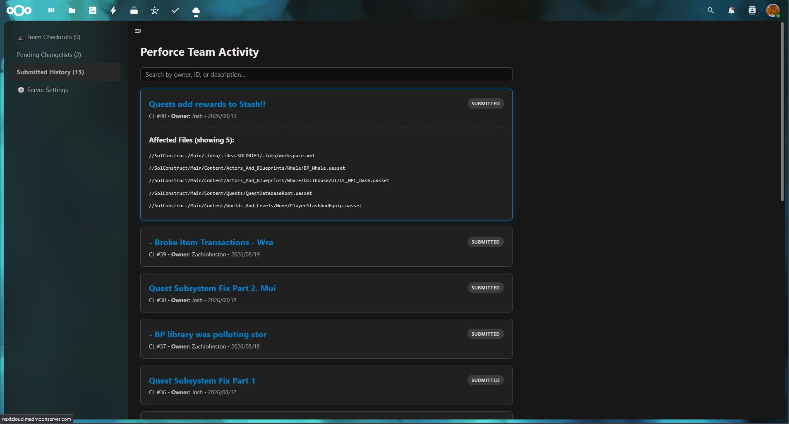

  A Nextcloud app that provides a fully searchable, live feed of checked out files and pending changelists, minimising workflow overlap and accelerating file debugging and diffing, instantly becoming a daily tool the team relies upon.

  

    <i class="fas fa-desktop"></i>
    Linux
  

  
  

    <i class="fas fa-code"></i>
    Web Dev
    Perforce
    Nextcloud
  

  
  

    <i class="fas fa-laptop-code"></i>
    CSS
    Optimisation
    Tools
  

  

  <h3><i class="far fa-star"></i>Extended Highlights</h3>
  <ul>
    <li>Built a custom Nextcloud Live App that hooks into Perforce via CLI shell scripts, stripping away P4V's clunky interface for a clean web dashboard.</li>
    <li>Solved performance lag by adding a Local JSON Cache and custom PHP env wrappers to handle heavy P4 queries seamlessly.</li>
    <li>Cleared team visibility bottlenecks with a Searchable Activity Feed, turning raw CLI logs into live updates on who is editing what.</li>
    <li>Turned a brand new workflow into an essential Daily Routine, helping everyone jump into work fully prepared with instant context.</li>
  </ul>

## Making Perforce a little more Accessible

While Perforce is an industry standard, its interface and visibility felt a little too complex for the team. They would frequently start their day unaware of exactly what others were working on or which files were currently locked, especially in the early days of getting everyone onboarded to Perforce.

To solve this, I developed a custom Nextcloud application that ties directly into our Perforce server. This integration provides a live feed of project activity right in the browser, completely removing the friction of traditional clients, and lets you see checked out files without opening the engine! 

  <video autoplay loop muted playsinline style="width: 100%; height: auto; display: block; margin: 0 !important;">
    <source src="PerforceLiveApp.webm" type="video/webm">
  </video>

## Live Tracking & Preparation

By exposing Perforce data through Nextcloud, the app instantly transformed how the team worked:

* **Live Activity Feed:** Team members can see exactly what files are checked out and view pending changelists in real time. This lets everyone feel more prepared starting their day, with full awareness of ongoing work.

* **Proper Search:** Fully searchable submissions and pending changelists allowed anyone to quickly find when specific revisions happened.

* **Better Context:** Having a highly searchable, web based history provides immediate context when diffing files or debugging tricky issues.