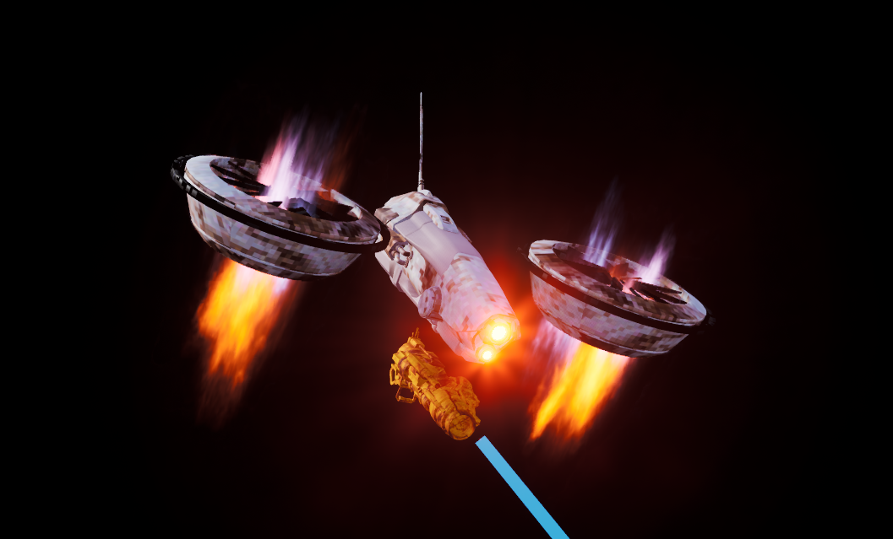
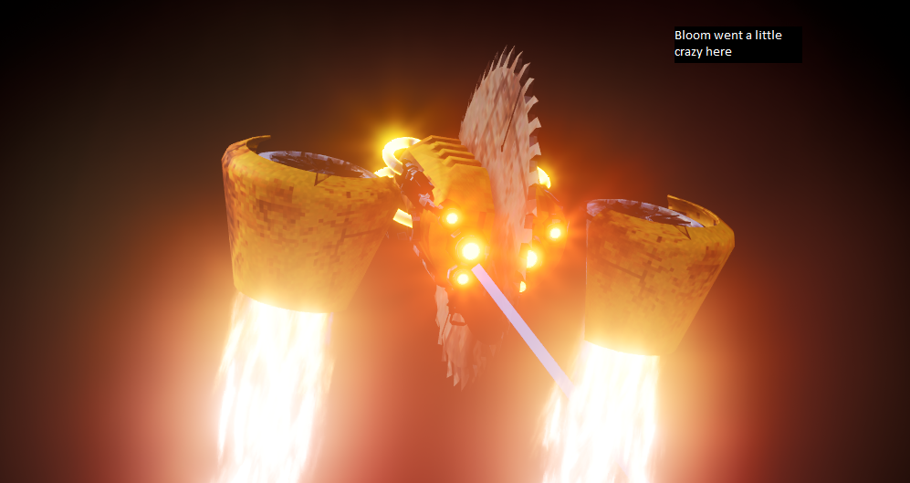
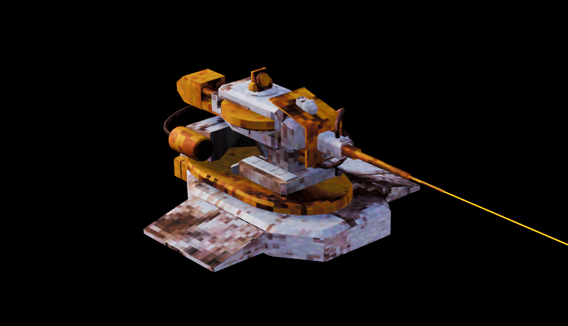
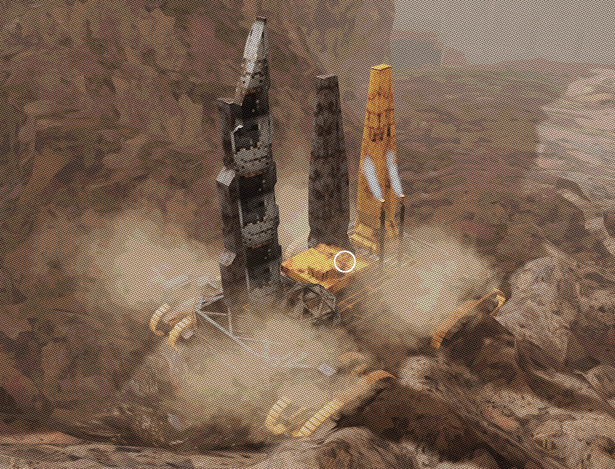

A high stakes SinglePlayer Survival Roguelite. Pilot a sentient flight combat rig built for survival in a decaying metal world. Obliterate your foes, harvest their scrap, and rebuild to survive.

  

    <i class="fas fa-desktop"></i>
    Windows
  

  
  

    <i class="fas fa-code"></i>
    C++
    Blueprints
    FLECS ECS
  

  
  

    <i class="fas fa-laptop-code"></i>
    Unreal Engine 5
    AI & Pathfinding
    Tech Art
  

  

  <h3><i class="far fa-star"></i> Contributions</h3>
  <ul>
    <li>Custom Enemy ecosystem with air and ground units.</li>
    <li>Core player flight, built with a tonne of playtesting, removing disorienting axis to create an intuitive flight model, using a custom replicatable movement component</li>
    <li>A super optimised projectile system using the FLECS C++ library.</li>
    <li>An Async Pathfinding and Utility EQS implementation for dynamic flight awareness.</li>
    <li>Developed an internal Plugin for procedural texture generation.</li>
    <li>Enemy behaviour, models, animation blueprints, weapons, health/armor components.</li>
    <li>Artyle iteration and 3D Art Tests.</li>
  </ul>

## Overview

SOL CONSTRUCT is the culmination of nearly 3 years of professional game development, encompassing all the triumphs, failures, and harsh lessons learned along the way. After oiginally setting out to make a flying game ([SOL DRIFT](http://localhost:1313/dev-portfolio/projects/sol-drift/)), we explored numerous genres before circling back to our roots, but this time with a hardened design philosophy.

As a small team, we had to evaluate every mechanic on a "Bang for Buck" basis. We realised early on that the highest degree of excitement and variation in our gameplay loop would come directly from our enemies. No matter our capacity for level design or weapon crafting, our core pillar became creating AI that dynamically exploits and challenges the player's actions. 

## Iterating the Player Flight Model

During the first few months of development, player movement was the most heavily debated feature. I originally implemented Gyro Aim and full 6 Degrees of Freedom (6DOF). However, playtests revealed it was even more polarising than Marmite. Some players really grasped it, but many simply spun out. We realised that trying to cram standard flight sim conventions into an arcade action space was actively fighting the player’s intuition, at least in our game. [Delivery Complete](https://store.steampowered.com/app/3639060/DELIVERY_MUST_COMPLETE/) actually managed to implement it in a way that looks so cool, and frankly looks way more satisfying than what we had.

  

Our solution was to strip it back. We removed roll and the ability to fly completely upside down, pivoting to a movement style akin to Minecraft’s creative mode or Interplay's Descent. While it was tough to say goodbye to true 6DOF, this restriction immediately gave players total, intuitive control over their positioning. We matched this mechanically with a modular ship design. A central frame where wings, thrusters, and turrets attach, heavily utilising procedural animation to make the craft feel responsive and weighty.

You can have a peep on what our anim graph looks like. Nothing too complex, but it adds a lot of juice:

  
<i class="fas fa-code"></i> Player Mesh Anim BP



## Designing a Flying Enemy Ecosystem

Designing flying enemies is a completely different beast compared to grounded AI. Because they have an entire Z axis of open space to utilise, restricting them and giving them purpose was my biggest design hurdle. To solve this, I modeled our enemy roster after chess pieces (definitely inspired by DOOM!), categorised by their effective engagement distances: **Stationary, Long Range, Medium, and Close Range**. 
  
</style>

<a data-fancybox="gallery" href="riveter.png" data-caption="The Riveter applying localized pressure.">
    
    
The Riveter applying localized pressure.

  </a>

  <a data-fancybox="gallery" href="rocket drone.png" data-caption="High-mobility Rocket Drone for explosive interception.">
    
    
High-mobility Rocket Drone for explosive interception.

  </a>

  <a data-fancybox="gallery" href="Cannon LFTR.png" data-caption="Heavy artillery Cannon LFTR engaging from a distance.">
    
    
Heavy artillery Cannon LFTR engaging from a distance.

  </a>

  <a data-fancybox="gallery" href="Saw.png" data-caption="The terrifying close-range Saw enemy designed to embed and disable.">
    
    
The terrifying close-range Saw enemy designed to embed and disable.

  </a>

  <a data-fancybox="gallery" href="sentry.png" data-caption="The aerial Sentry unit patrolling the perimeter.">
    
    
The aerial Sentry unit patrolling the perimeter.

  </a>

  <a data-fancybox="gallery" href="HeavyCrawler.png" data-caption="The heavily armored Crawler unit.">
    
    
The heavily armored Crawler unit.

  </a>

My golden rule for designing and implementing *every* new enemy was asking: *"What action am I trying to exploit from the player?"*

For example:
* **Long-range enemies** are designed to encourage and exploit the player's dash.
* **Short-range enemies** force the player to constantly reconsider their spatial positioning.

  

Because we always wanted a minimum level of enemy density in encounters, these units had to complement each other. They don't necessarily "communicate" via code, but their roles naturally synergise. For example, I recently implemented a close range "Saw" enemy that embeds itself in the player, dealing tick damage but, more importantly, *disabling the player's dash and dodge*. If left unchecked, this allows the Long Range sniper enemies (who usually miss a dashing player) to easily land devastating hits. This encourages the player to approach encounters strategically, prioritising targets based on the specific restrictions their synergy imposes.

  

## Frankensteined Pathfinding & EQS

To bring these designs to life, the AI needed to understand 3D space. I frankensteined an existing [pathfinding plugin](https://github.com/NonStaticGH/CPathHostProject) combining Sparse Voxel Octrees with A* Pathfinding. 

**The Async Solution:** Initially, synchronous pathfinding calls choked our Game Thread, causing massive stutters if multiple enemies requested paths simultaneously. By moving to an Async solution, I smoothed out the frame rate, carefully tuning the graph update rates to avoid garbage collection hitches.

**EQS Implementation:** I replaced our early, hacky target tracking with a much more robust Environment Query System (EQS). Enemies now transition through Patrolling, Searching, and Attacking states based on true Perception (hearing, damage, visibility). Using Dot product math, I programmed enemies to evaluate points based on the player's orientation, allowing them to intelligently flank or close distance dynamically based on their role. This single feature completely blew our minds and gave us so much motivation to move forward.

  
  

    *Query used by medium range enemies.*
  

  
EQS Medium Range Query breakdown

**Volumetric grid Generation:** The query generates a large 3D spherical grid of potential movement locations (a 3000-unit radius with 500-unit spacing), giving the flying AI a full 6 Degrees of Freedom (6DOF) spatial canvas to evaluate.

E**nvironmental & Range Filtering:** It utilizes a boolean Trace test to immediately cull any points obstructed by world geometry (ensuring a clear line of sight to the player) alongside a strict Distance filter to discard points outside the enemy's effective combat range.

**"Smart" Positioning via Dot Product:** The remaining viable points are scored using an Inverse Linear Distance modifier and a Dot Product test. This mathematically evaluates points relative to the player's facing direction, driving the AI to intelligently flank or prioritize specific angles of attack rather than simply flying straight at the target.

## Streamlining the Pipeline (ProcTex Plugin)

To get that crunchy aesthetic without bottlenecking production, I developed a custom Editor Utility Plugin. Rather than going in and out of Substance Painter for every asset, ProcTex allows us to down res, posterize, and manipulate textures with a real time 3D preview directly inside the Unreal Editor. This tool single handedly sped up our asset creation pipeline, allowing the team to generate game ready materials in minutes. You can find more deets on it [here](https://beanm00n.github.io/dev-portfolio/projects/procedural-texture-baker/).

