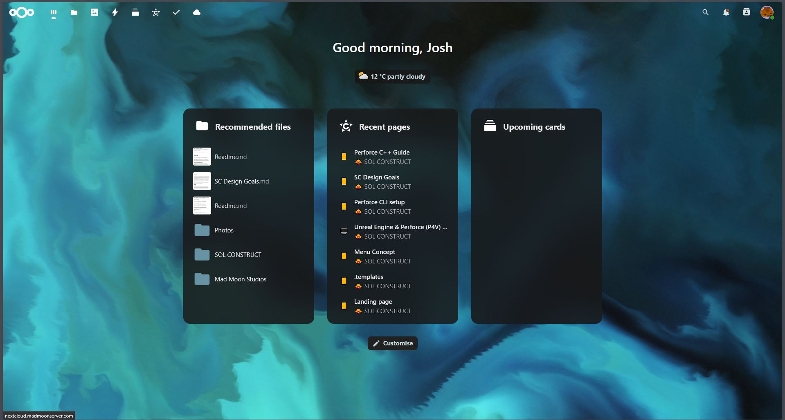
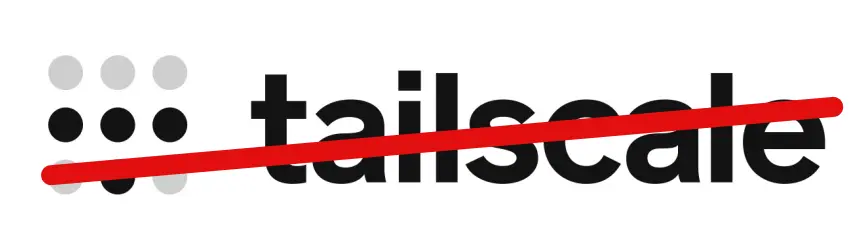
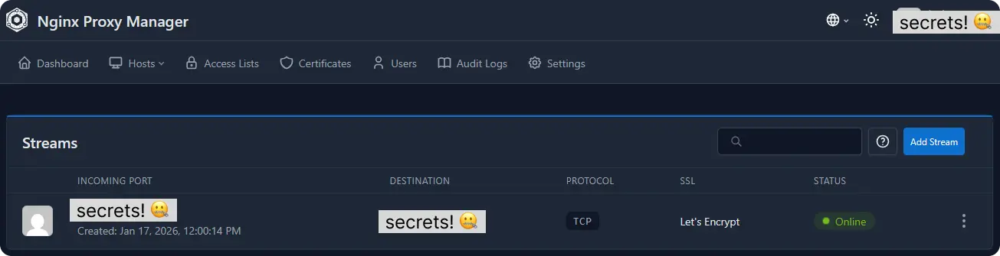

  Deployed a centralised Nextcloud and Perforce server environment tailored to the team's pipeline, easing asset management and establishing a reliable, autonomous version control.

  

    <i class="fas fa-desktop"></i>
    Linux
  

  
  

    <i class="fas fa-code"></i>
    Web Dev
    Perforce
    Nextcloud
    Cloudflared
  

  
  

    <i class="fas fa-laptop-code"></i>
    NGINX
    TrueNAS
    Tools
  

  

  <h3><i class="far fa-star"></i> Highlights</h3>
  <ul>
    <li>Built a custom TrueNAS & Perforce Server from spare office PC parts, completely eliminating Git LFS merge nightmares and monthly cloud subscription fees.</li>
    <li>Bypassed WAN TCP limitations by chaining Cloudflared Tunnels with NGINX SSL, granting the remote team seamless, secure access without finicky VPNs.</li>
    <li>Deployed a centralised Nextcloud Asset Hub featuring in-browser 3D FBX inspection so the team can preview models without opening a game Engine.</li>
    <li>turned a fragile, overlapping pipeline into a Zero Cost Hub, delivering instant version control relief and immediate access for the entire team.</li>
  </ul>

## Squashing a Bottleneck

As our project grew, our team started tripping over each other's workflows on GitHub, leading to several near miss merges and frankly very unorganised asset managment. At the same time, subscriptions like Google Drive and Google Workspace were becoming unnecessarily expensive to maintain as file counts exploded, especially if we were to expand the team in the future. It was a castle built on sand.

To minimise these bottlenecks, I built a dedicated server using spare PC parts sitting around the office, supplemented by a few cheap hardware upgrades. The goal was to create a ***single*** centralised and accessible infrastructure that gave us total control over our pipeline without ongoing software costs.

## Asset Management with TrueNAS & Nextcloud

  

The foundation was built on TrueNAS hosting Nextcloud to handle general asset storage. To make local services accessible anywhere without exposing vulnerable ports raw to the internet, we implemented Cloudflared tunneling and reverse proxies.

* **Secure Remote Access:** Cloudflared tunnels forward local server ports, allowing remote team members to access TrueNAS and Nextcloud from anywhere.  

* **Workflow Integration:** Integrated browser friendly tools, such as native FBX 3D viewers, directly into Nextcloud so team members can inspect 3D assets without launching the engine.

* **Easy Storage:** Google Drive-like experience for ***zero*** monthly software fees, making asset sharing across team members immediate and organised.

Best part is, all of this is accessible in browser, which means mobile interaction is inherently supported! Let me tell you, It's a pretty cool feeling popping into the office and loading up a new asset on your phone, spinning it around, zooming in, etc. The power of GPU accleration will never not blow my mind.

  <video autoplay loop muted playsinline style="width: 100%; height: auto; display: block; margin: 0 !important;">
    <source src="FBXViewerExample.webm" type="video/webm">
  </video>

## Perforce Architecture & Routing Challenges

Deploying Perforce alongside Nextcloud proved significantly more challenging due to how Perforce handles raw TCP connections over WAN setups. This frankly took a tonne of trial and error to get right.

### The Initial Attempt: Mesh VPN

  

I initially tested routing traffic through Tailscale VPN straight to the server's home IP, allowing folks to connect "locally" via TCP on port 1666. While functional for testing, forcing an entire team to maintain active VPN tunnels was far too finicky and fragile for daily production.

### The Solution: Cloudflared + NGINX SSL

To achieve a seamless, client-side connection experience, I ended up chaining together a pipeline consisting of Server Port Forwarding, a Cloudflared TCP Tunnel, and NGINX for SSL termination. SSL Certification was truly the rotten cherry on top of such already difficult cake.

  

While routing through multiple tunnel and proxy layers introduces a minor network latency overhead, in practice we found the connection speeds feel identical to commercial cloud drives.

## Results & Workflow Impact

Building the infrastructure from scratch provided deep insight into Perforce's underlying architecture - moving far beyond basic checkout/submit mechanics to configuring Streams, Depots, Workspaces, and Revision histories.

* **No Merge issues (*yet*):** Stopped workflow collisions and merge risk caused by mismanaged Git LFS setups. 

* **Instant Adoption:** The team instantly gained a secure, central hub accessible via simple web links and standard logins, immediately becoming a part of people's daily workflows.

* **Customisable to your heart's content:** This is an environment where custom editor utilities, automation tools, and project settings can be pushed centrally to support team needs, for example this other cool project I put together 

