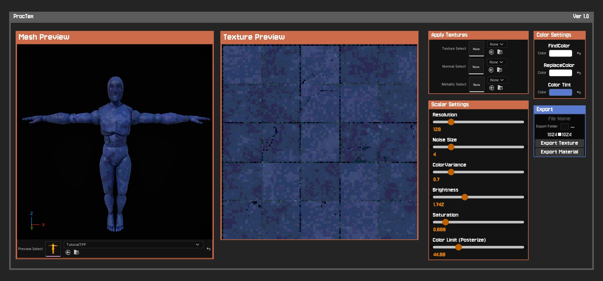
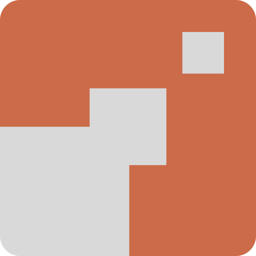
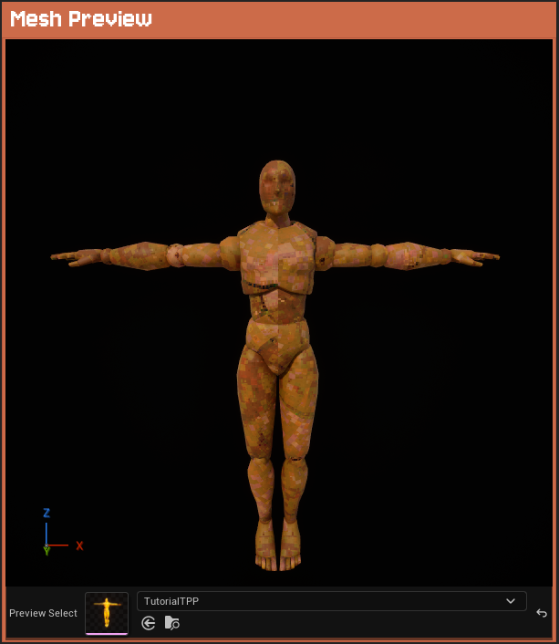
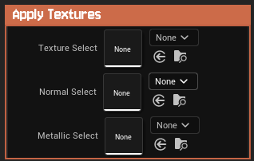
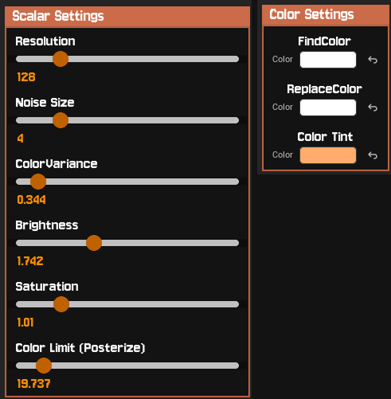
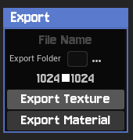

<style>
  /* 1. Set the fixed, darkened background image for the whole page */
  body {
    background-image: linear-gradient(rgba(15, 23, 42, 0.55), rgba(15, 23, 42, 0.85)), url('ProcTex.jpg') !important;
    background-size: cover !important;
    background-attachment: fixed !important;
    background-position: top !important;
  }

  /* 2. Wrap your content in a premium "glass" card */
  article {
    background-color: rgba(30, 41, 59, 0.6) !important;
    backdrop-filter: blur(12px);
    -webkit-backdrop-filter: blur(12px);
    border: 1px solid rgba(255, 255, 255, 0.1);
    border-radius: 1.5rem;
    padding: 3rem;
    margin-top: 3rem;
    margin-bottom: 3rem;
    width: 100% !important;
    max-width: 900px !important; /* Expanded from the theme's default ~700px */
    margin-left: auto !important;
    margin-right: auto !important;
  }

  /* Prevent browser anchor jumps from overshooting */
  article h2, article h3 {
    scroll-margin-top: 120px !important;
  }

  /* 3. Table of Contents - Glass Card & Links */
  .hb-toc > div {
    background-color: rgba(30, 41, 59, 0.6) !important;
    backdrop-filter: blur(12px);
    -webkit-backdrop-filter: blur(12px);
    border-radius: 1rem;
    padding: 1.5rem !important;
    border-left: 4px solid #e05e5e !important; 
    height: fit-content !important; 
    margin-top: 3rem !important;
  }

  .hb-toc p {
    color: white !important;
    font-size: 1.1rem !important;
    margin-bottom: 1rem !important;
    font-weight: 600 !important;
    text-transform: none !important;
  }

  .hb-toc ul {
    list-style: none !important;
    padding-left: 0 !important;
    margin: 0 !important;
  }
  
  .hb-toc ul ul {
    padding-left: 1rem !important; 
  }

  .hb-toc a {
    color: #94a3b8 !important; 
    text-decoration: none !important;
    display: block !important;
    padding: 0.35rem 0.8rem !important;
    border-radius: 9999px !important; 
    transition: all 0.2s ease-in-out;
    margin-bottom: 0.25rem !important;
    font-size: 0.9rem !important;
    border: 1px solid transparent !important; 
  }

  .hb-toc a:hover {
    color: white !important;
    background-color: rgba(255, 255, 255, 0.05) !important;
  }

  /* --- GUARANTEED RED PILL ACTIVE STATE --- */
  .hb-toc a.red-pill-active {
    color: white !important;
    border: 1px solid #e05e5e !important; 
    background-color: transparent !important;
  }

  /* ========================================== */
  /* TONY'S HIGHLIGHTS & TAGS CSS               */
  /* ========================================== */

  /* Hide the native Hugo Blox tags block at the very bottom */
  .article-tags, 
  .pub-tags, 
  div:has(> a[href*="/tags/"]) {
    display: none !important;
  }

  /* Indented Blurb Styling */
  .tony-blurb {
    border-left: 4px solid #e05e5e;
    padding-left: 1.5rem;
    margin: 1.5rem 0 2.5rem 0;
    font-size: 1.15rem;
    line-height: 1.6;
    color: #94a3b8;
    font-style: italic;
  }

  /* Specs & Tech Tag Rows */
  .tony-specs-container {
    display: flex;
    flex-direction: column;
    gap: 0.8rem;
    margin-bottom: 2.5rem;
  }

  .tony-spec-row {
    display: flex;
    align-items: center;
    gap: 1rem;
    color: white;
  }

  .tony-spec-row i {
    width: 24px;
    font-size: 1.25rem;
    text-align: center;
    color: #cbd5e1;
  }

  /* Custom Pill Buttons */
  .tony-pill {
    padding: 0.25rem 0.8rem;
    border-radius: 0.35rem;
    font-size: 0.85rem;
    font-weight: 700;
    letter-spacing: 0.025em;
  }

  .tony-pill.blue {
    background-color: #0070f3;
    color: white;
  }

  .tony-pill.black {
    background-color: #000000;
    color: white;
    border: 1px solid rgba(255, 255, 255, 0.15);
  }

  /* Highlights Card Box */
  .tony-highlights-card {
    background-color: rgba(30, 41, 59, 0.2);
    border: 2px solid rgba(224, 94, 94, 0.35);
    border-radius: 1rem;
    padding: 2rem;
    margin-bottom: 3rem;
  }

  .tony-highlights-card h3 {
    color: white !important;
    font-size: 1.35rem !important;
    font-weight: 700 !important;
    margin-top: 0 !important;
    margin-bottom: 1.25rem !important;
    display: flex;
    align-items: center;
    gap: 0.6rem;
  }

  .tony-highlights-card h3 i {
    color: #e05e5e;
  }

  .tony-highlights-card ul {
    list-style-type: disc !important;
    padding-left: 1.5rem !important;
    margin: 0 !important;
  }

  .tony-highlights-card li {
    color: #cbd5e1 !important;
    margin-bottom: 0.85rem !important;
    line-height: 1.6;
    font-size: 1rem;
  }

  .tony-highlights-card li:last-child {
    margin-bottom: 0 !important;
  }

  /* Specific Keyword Highlight Text */
  .keyword-red {
    color: #e05e5e;
    font-weight: 600;
  }

  /* ========================================== */
  /* GLASS IMAGE CAROUSEL CSS                   */
  /* ========================================== */
  .glass-carousel {
    display: flex;
    gap: 1rem;
    overflow-x: auto;
    padding-bottom: 1rem;
    margin-top: 2rem;
    margin-bottom: 2rem;
    scroll-snap-type: x mandatory;
    scrollbar-width: thin;
    scrollbar-color: #e05e5e rgba(255, 255, 255, 0.05);
  }

  .glass-carousel::-webkit-scrollbar {
    height: 8px;
  }
  .glass-carousel::-webkit-scrollbar-track {
    background: rgba(255, 255, 255, 0.05);
    border-radius: 4px;
  }
  .glass-carousel::-webkit-scrollbar-thumb {
    background: #e05e5e;
    border-radius: 4px;
  }

  .glass-carousel img {
    height: 300px; 
    width: auto;
    border-radius: 0.8rem;
    border: 1px solid rgba(255, 255, 255, 0.1);
    box-shadow: 0 4px 15px rgba(0,0,0,0.3);
    scroll-snap-align: start;
    flex-shrink: 0;
    object-fit: cover;
    background-color: rgba(0, 0, 0, 0.5); 
    cursor: pointer;
    transition: transform 0.2s ease, border-color 0.2s ease;
  }

  .glass-carousel img:hover {
    transform: scale(1.02);
    border-color: #e05e5e;
  }

  /* ========================================== */
  /* EXPANDED IMAGE MODAL (LIGHTBOX) CSS        */
  /* ========================================== */
  #lightbox-modal {
    position: fixed;
    z-index: 9999;
    left: 0;
    top: 0;
    width: 100%;
    height: 100%;
    background-color: rgba(15, 23, 42, 0.95);
    backdrop-filter: blur(10px);
    -webkit-backdrop-filter: blur(10px);
    display: flex;
    justify-content: center;
    align-items: center;
    opacity: 0;
    pointer-events: none;
    transition: opacity 0.3s ease;
  }

  #lightbox-modal.lightbox-visible {
    opacity: 1;
    pointer-events: auto;
  }

  .lightbox-content {
    max-width: 90%;
    max-height: 90%;
    border-radius: 1rem;
    box-shadow: 0 25px 50px -12px rgba(0, 0, 0, 0.7);
    border: 1px solid rgba(255, 255, 255, 0.1);
  }

  .lightbox-close {
    position: absolute;
    top: 30px;
    right: 40px;
    color: white;
    font-size: 40px;
    font-weight: bold;
    cursor: pointer;
    transition: color 0.2s ease;
  }

  .lightbox-close:hover {
    color: #e05e5e;
  }

/* ========================================== */
  /* COLLAPSIBLE CODE BLOCKS CSS                */
  /* ========================================== */
  details.code-dropdown {
    background: rgba(30, 41, 59, 0.4);
    border: 1px solid rgba(255, 255, 255, 0.1);
    border-radius: 0.5rem;
    margin-top: 1rem;
    margin-bottom: 1.5rem;
    overflow: hidden;
  }

  details.code-dropdown summary {
    padding: 1rem;
    font-weight: 600;
    color: #e05e5e;
    cursor: pointer;
    user-select: none;
    outline: none;
    transition: background 0.2s ease;
  }

  details.code-dropdown summary:hover {
    background: rgba(255, 255, 255, 0.05);
  }

  details.code-dropdown .highlight {
    margin: 0 !important;
    border-radius: 0 0 0.5rem 0.5rem;
  }

  /* --- NEW: Force darker background & smaller text --- */
  details.code-dropdown .highlight pre {
    background-color: rgba(10, 15, 24, 0.95) !important; /* Deep dark background */
    padding: 1.25rem !important;
  }

  details.code-dropdown .highlight code {
    font-size: 0.8rem !important; /* Shrinks the text down */
    line-height: 1.5 !important;
  }

  /* --- NEW: Shrink general base text and lists --- */
  article p, 
  article li {
    font-size: 0.95rem !important; /* Drops it slightly below engine standard */
    line-height: 1.6 !important;   /* Keeps the spacing clean and highly readable */
  }

  /* --- NEW: Shrink the top intro blurb proportionately --- */
  .tony-blurb {
    font-size: 1.05rem !important; /* Scaled down slightly from 1.15rem */
  }
</style>

<script>
  document.addEventListener('DOMContentLoaded', () => {
    // 1. Table of Contents Scroll Highlighting
    const observer = new IntersectionObserver((entries) => {
      entries.forEach(entry => {
        const id = entry.target.getAttribute('id');
        const link = document.querySelector(`.hb-toc a[href="#${id}"]`);
        
        if (entry.isIntersecting && link) {
          document.querySelectorAll('.hb-toc a').forEach(l => l.classList.remove('red-pill-active'));
          link.classList.add('red-pill-active');
        }
      });
    }, { rootMargin: '-20% 0px -70% 0px' });

    document.querySelectorAll('article h2, article h3').forEach(h => observer.observe(h));

    // 2. Lightbox Modal Logic
    const modal = document.getElementById('lightbox-modal');
    const modalImg = document.getElementById('lightbox-img');
    const closeBtn = document.querySelector('.lightbox-close');
    const carouselImages = document.querySelectorAll('.glass-carousel img');

    // Open modal on image click
    carouselImages.forEach(img => {
      img.addEventListener('click', () => {
        modal.classList.add('lightbox-visible');
        modalImg.src = img.src;
      });
    });

    // Close on X button click
    if(closeBtn) {
      closeBtn.addEventListener('click', () => {
        modal.classList.remove('lightbox-visible');
      });
    }

    // Close when clicking on the dark background
    if(modal) {
      modal.addEventListener('click', (e) => {
        if (e.target !== modalImg) {
          modal.classList.remove('lightbox-visible');
        }
      });
    }
  });
</script>

<div style="margin-bottom: 2.5rem; max-width: 100%; border-radius: 0.5rem; overflow: hidden; display: inline-block; box-shadow: 0 4px 15px rgba(0,0,0,0.3);">
  <iframe frameborder="0" src="https://itch.io/embed/4676252?bg_color=242424&amp;fg_color=ffffff&amp;link_color=476ed3&amp;border_color=cc6b4a" width="552" height="167"><a href="https://mad-moon-studios.itch.io/proctex-plugin">ProcTex Plugin by Mad Moon Studios</a></iframe>
</div>

<div class="tony-blurb">
  Turn any texture into a retro asset directly inside Unreal Engine! ProcTex is a handy, lightweight Editor Utility Plugin for Unreal Engine 5.6 originally built as a pipeline tool for our game <b>SOL CONSTRUCT</b>. It allows you to down-res, posterize, and manipulate textures with a real-time 3D preview without ever leaving the Editor.
</div>

<div class="tony-specs-container">
  <div class="tony-spec-row">
    <i class="fas fa-desktop"></i>
    <span class="tony-pill blue">Windows</span>
  </div>
  
  <div class="tony-spec-row">
    <i class="fas fa-code"></i>
    <span class="tony-pill blue">C++</span>
    <span class="tony-pill blue">Blueprints</span>
    <span class="tony-pill blue">Tech Art</span>
  </div>
  
  <div class="tony-spec-row">
    <i class="fas fa-laptop-code"></i>
    <span class="tony-pill black">Unreal Engine</span>
    <span class="tony-pill black">Tools</span>
  </div>
</div>

<div style="margin-bottom: 2.5rem; border-radius: 1rem; overflow: hidden; border: 1px solid rgba(255, 255, 255, 0.1); box-shadow: 0 10px 30px rgba(0,0,0,0.5);">
  
</div>

<div class="tony-highlights-card">
  <h3><i class="far fa-star"></i> Highlights</h3>
  <ul>
    <li>Created a custom C++ Editor tool with <span class="keyword-red">Native UI Integration</span> directly into the main Level Editor toolbar.</li>
    <li>Added a general 3D previewer supporting both <span class="keyword-red">Static Meshes and Skeletal Meshes</span> inside a custom environment.</li>
    <li>Built responsive <span class="keyword-red">Sliding Filters</span> allowing real time adjustments to Resolution, Noise, Color Variance, and Posterization.</li>
    <li>Created a simple <span class="keyword-red">One Click Export</span> system to bake generated texture data into raw Texture Assets or readys to use Materials directly into the Content Browser.</li>
  </ul>
</div>

## Plugin Overview

ProcTex was born out of a need to rapidly iterate on retro assets during the development of SOL CONSTRUCT. Rather than bouncing back and forth between external texture editing software and the engine, I wanted a native environment to instantly create our textures.

**Core Tool Features:**

* **Live 3D & 2D Previews:** Updates applied via the UI parameters are mapped in real time to an isolated 2D canvas and a full 3D viewport.

* **Universal Mesh Support:** Use a drop down menu to assign any custom Static or Skeletal mesh to preview the texture application. 

* **Color Correction & Filters:** Swap specific colors, adjust global tint, tweak brightness, and crush saturation. The built in posterize limits color depth to achieve that authentic, chunky feel.

* **Flexible Export:** You have the choice to either export raw textures to plug into your own custom shader pipelines, or export everything packaged cleanly into a ready to use Unreal Material. 

<div class="glass-carousel">
  
  
  
  
  
</div>

*(Little Side note: Coincidentally, Puck's Pixelizer came out right around the time I was building this! Their tool is incredibly robust and offers a ton of advanced features, so I highly recommend checking it out if you need a heavier-duty solution, plus their palette stuff is super neat!)*

## Technical Implementation

Developing ProcTex required bridging the gap between Blueprint Editor Utility Widgets (EUWs) and C++ Editor modules to achieve a seamless, native feel. This was the first "tool" I've ever built so it was certaintly a journey trying to figure this stuff out 😅.

* **Custom 3D Viewport in UMG:** To render a live 3D mesh inside a UMG widget, I created a custom Slate viewport leveraging `SEditorViewport` and `FAdvancedPreviewScene`. This required creating a custom subclass of `FEditorViewportClient` to dynamically override the background color (matching the editor's UI hex colors) and locking Post Process exposure settings so the preview meshes wouldn't completely blow out against the dark background.

<details class="code-dropdown">
  <summary><i class="fas fa-code"></i> View C++: Slate Viewport Client Override</summary>

```cpp
// Custom Viewport Client to Override the Background
class FMyPreviewViewportClient : public FEditorViewportClient
{
public:
    FMyPreviewViewportClient(FPreviewScene* InPreviewScene)
        : FEditorViewportClient(nullptr, InPreviewScene)
    {
    }

    // Overrides the default engine color with matching UI Hex
    virtual FLinearColor GetBackgroundColor() const override
    {
        return FColor::FromHex(TEXT("#131313"));
    }
};

// ... inside SMyCustomViewport ::MakeEditorViewportClient() ...
MyViewportClient = MakeShareable(new FMyPreviewViewportClient(PreviewScene.Get()));
MyViewportClient->bSetListenerPosition = false;
MyViewportClient->SetRealtime(true);
```
</details>

**Overcoming Quirks with SinglePropertyViews:**
    Building a simple dropdown to select either a Static or Skeletal mesh ran into UE5's strict property typing. I solved this by defining a generic UObject* variable in C++ using the AllowedClasses = "StaticMesh,SkeletalMesh" specifier. To bypass UMG bugs, the widget dynamically binds to itself using an Event Pre Construct node before executing a C++ cast to seamlessly swap the hidden mesh components in the preview scene.

<details class="code-dropdown">
  <summary><i class="fas fa-code"></i> View C++: Slate Viewport Client Override</summary>

```cpp
void UModelPreviewWidget::ApplyMeshAsset()
{
#if WITH_EDITOR
    // Safely cast the generic UObject parameter assigned via the SinglePropertyView
    if (UStaticMesh* SM = Cast<UStaticMesh>(PreviewMeshAsset))
    {
        SetStaticMesh(SM);
    }
    else if (USkeletalMesh* SKM = Cast<USkeletalMesh>(PreviewMeshAsset))
    {
        SetSkeletalMesh(SKM);
    }
    else 
    {
        SetStaticMesh(nullptr);
        SetSkeletalMesh(nullptr);
    }
#endif
}
```
</details>

**Overcoming Quirks with SinglePropertyViews:**
Building a simple dropdown to select either a Static or Skeletal mesh ran into UE5's strict property typing. I solved this by defining a generic UObject* variable in C++ using the AllowedClasses = "StaticMesh,SkeletalMesh" specifier. To bypass UMG bugs, the widget dynamically binds to itself using an Event Pre Construct node before executing a C++ cast to seamlessly swap the hidden mesh components in the preview scene.

<details class="code-dropdown">
  <summary><i class="fas fa-code"></i> View C++: Slate Viewport Client Override</summary>

```cpp
void UModelPreviewWidget::ApplyMeshAsset()
{
#if WITH_EDITOR
    // Safely cast the generic UObject parameter assigned via the SinglePropertyView
    if (UStaticMesh* SM = Cast<UStaticMesh>(PreviewMeshAsset))
    {
        SetStaticMesh(SM);
    }
    else if (USkeletalMesh* SKM = Cast<USkeletalMesh>(PreviewMeshAsset))
    {
        SetSkeletalMesh(SKM);
    }
    else 
    {
        SetStaticMesh(nullptr);
        SetSkeletalMesh(nullptr);
    }
#endif
}
```
</details>

  **Procedural Material Architecture:**
    The underlying retro rendering logic relies heavily on parameterized Materials all working together. The posterization effect, for instance, uses a streamlined Multiply -> Floor -> Divide math operation to snap 0-1 color values into distinct visual bands. By updating global parameters via Dynamic Material Instances, sliders in the UI recalculate the shader logic instantly.

