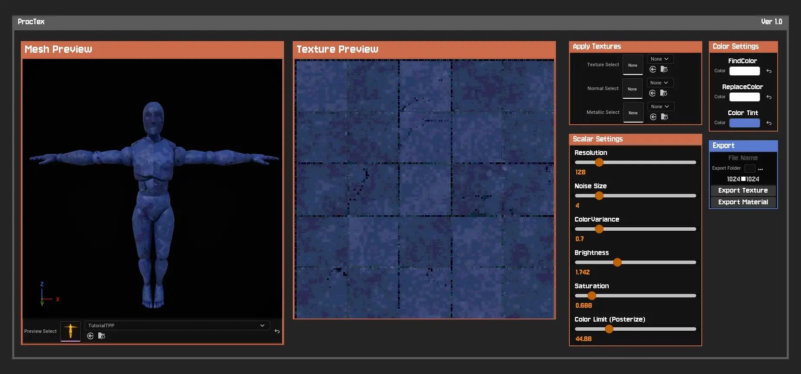
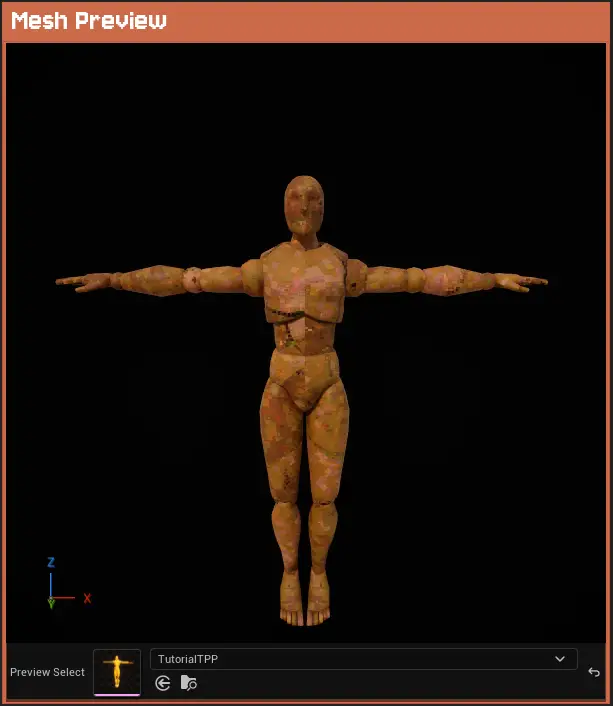
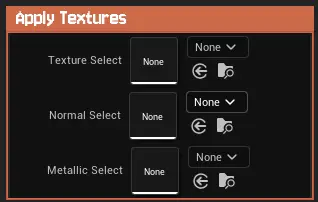
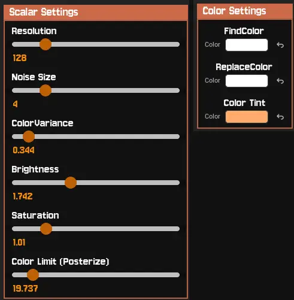
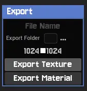

  <iframe frameborder="0" src="https://itch.io/embed/4676252?bg_color=242424&amp;fg_color=ffffff&amp;link_color=476ed3&amp;border_color=cc6b4a" width="552" height="167"><a href="https://mad-moon-studios.itch.io/proctex-plugin">ProcTex Plugin by Mad Moon Studios</a></iframe>

  Turn any texture into a retro asset directly inside Unreal Engine! ProcTex is a handy, lightweight Editor Utility Plugin for Unreal Engine 5.6 originally built as a pipeline tool for our game <b>SOL CONSTRUCT</b>. It allows you to down-res, posterize, and manipulate textures with a real-time 3D preview without ever leaving the Editor.

  

    <i class="fas fa-desktop"></i>
    Windows
  

  
  

    <i class="fas fa-code"></i>
    C++
    Blueprints
    Tech Art
  

  
  

    <i class="fas fa-laptop-code"></i>
    Unreal Engine
    Tools
  

  

  <h3><i class="far fa-star"></i>Extended Highlights</h3>
  <ul>
    <li>Created a custom C++ Editor tool with Native UI Integration directly into the main Level Editor toolbar.</li>
    <li>Added a general 3D previewer supporting both Static Meshes and Skeletal Meshes inside a custom environment.</li>
    <li>Built responsive Sliding Filters allowing real time adjustments to Resolution, Noise, Color Variance, and Posterization.</li>
    <li>Created a simple One Click Export system to bake generated texture data into raw Texture Assets or readys to use Materials directly into the Content Browser.</li>
  </ul>

## Plugin Overview

ProcTex was born out of a need to rapidly iterate on retro assets during the development of SOL CONSTRUCT. Rather than bouncing back and forth between external texture editing software and the engine, I wanted a native environment to instantly create our textures.

**Core Tool Features:**

* **Live 3D & 2D Previews:** Updates applied via the UI parameters are mapped in real time to an isolated 2D canvas and a full 3D viewport.

* **Universal Mesh Support:** Use a drop down menu to assign any custom Static or Skeletal mesh to preview the texture application. 

* **Color Correction & Filters:** Swap specific colors, adjust global tint, tweak brightness, and crush saturation. The built in posterize limits color depth to achieve that authentic, chunky feel.

* **Flexible Export:** You have the choice to either export raw textures to plug into your own custom shader pipelines, or export everything packaged cleanly into a ready to use Unreal Material. 

  
  
  
  

*(Little Side note: Coincidentally, Puck's Pixelizer came out right around the time I was building this! Their tool is incredibly robust and offers a ton of advanced features, so I highly recommend checking it out if you need a heavier-duty solution, plus their palette stuff is super neat!)*

## Technical Implementation

Developing ProcTex required bridging the gap between Blueprint Editor Utility Widgets (EUWs) and C++ Editor modules to achieve a seamless, native feel. This was the first "tool" I've ever built so it was certaintly a journey trying to figure this stuff out 😅.

* **Custom 3D Viewport in UMG:** To render a live 3D mesh inside a UMG widget, I created a custom Slate viewport leveraging `SEditorViewport` and `FAdvancedPreviewScene`. This required creating a custom subclass of `FEditorViewportClient` to dynamically override the background color (matching the editor's UI hex colors) and locking Post Process exposure settings so the preview meshes wouldn't completely blow out against the dark background.



## Overcoming Quirks with SinglePropertyViews:
Building a simple dropdown to select either a Static or Skeletal mesh ran into UE5's strict property typing. I solved this by defining a generic UObject* variable in C++ using the AllowedClasses = "StaticMesh,SkeletalMesh" specifier. To bypass UMG bugs, the widget dynamically binds to itself using an Event Pre Construct node before executing a C++ cast to seamlessly swap the hidden mesh components in the preview scene.



## Procedural Material Architecture:
The underlying retro rendering logic relies heavily on parameterized Materials all working together. The posterization effect, for instance, uses a streamlined Multiply -> Floor -> Divide math operation to snap 0-1 color values into distinct visual bands. By updating global parameters via Dynamic Material Instances, sliders in the UI recalculate the shader logic instantly.

