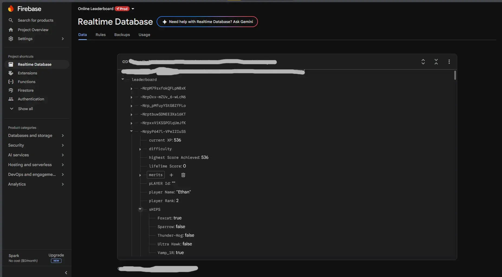
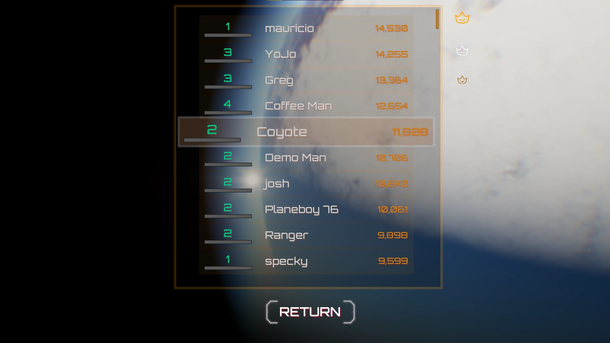
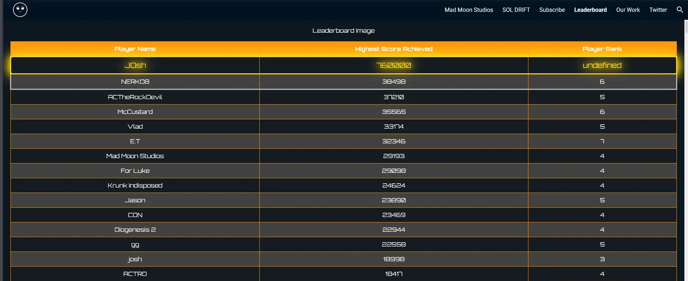

  A Flight Shooter where perpetual, aggressive movement is your primary weapon and defense. Success depends on chaining an arsenal of movement abilities to evade death and create openings for attack.

  

    <i class="fas fa-desktop"></i>
    Windows
  

  
  

    <i class="fas fa-code"></i>
    Blueprints
    Mass Entity ECS
  

  
  

    <i class="fas fa-laptop-code"></i>
    Unreal Engine 5
    AI & Pathfinding
    Tech Art
  

  <video autoplay loop muted playsinline style="width: 100%; height: auto; display: block; margin: 0 !important;">
    <source src="SOL DRIFT Preview 720p.webm" type="video/webm">
  </video>

  <h3><i class="far fa-star"></i>Extended Contributions</h3>
  <ul>
    <li>Radial Upgrade Menu, procedurally updated based on amount of rewards. .</li>
    <li>Full Player Movement integration, creating "Faked" momentum for customisable game feel.</li>
    <li>Full Enemy Implementation; Curve based flight paths, Behaviour Trees, Weaponry, Defenses (Chaff, Smoke, etc.).</li>
    <li>Every single 3D Asset and associated Textures and most animations.</li>
    <li>"Gyroscopic" Camera movement using Mouse Position and Curve based Sensitivity.</li>
    <li>Online Leaderboard Test: Http Post/Get for sending and receiving data, hosted on a website using Google Firebase as backend for Testing.</li>
  </ul>

## Radial Menu

  <video autoplay loop muted playsinline style="width: 100%; height: auto; display: block; margin: 0 !important;">
    <source src="SOL DRIFT Radial Menu.webm" type="video/webm">
  </video>

Materials and UMG working hand-in-hand to generate a set of upgrades in a radial wheel, expandable to as many slices as you'd like or to whatever size text you're capable of reading! Fun solution to a problem that didn't quite have a determined direction, hence the procedural nature of it. It was also the first time I tried messing with generating SDF shapes in Materials, a trial that would come in handy in many future material endeavours. 

## Realtime Leaderboard

One of the coolest mixes of tech and game I got to experiment with. It never made it beyond the initial prototyping stages, but taught me heaps on how external data can be stored, streamed, updated and even influence gameplay!

  

I needed a foundation to work with - one that could help with in-engine implementation and then be upgraded to a more secure and faster storage method - and with that in mind I decided to try Google Firebase's Realtime Databases. Before testing it in engine, I used simple services like Postman to test HTTPS Posting and Getting, a process that turned out to be a lot easier than I was expecting.

  

Next came Engine Implementation using some simple Maps and sorting based on score. Beyond just scoreboard data like Name and Score, we tested sending some other values, like ENTIRE save structs! That was a weird experiment, but bore some exceptionally useful fruit, allowing us to make changes on the fly during gameplay, unlocking ships, soft locks, and even adjust numbers on the fly for balancing. It ended up being the PERFECT playtesting tool, allowing live adjustments and comparisons across hundreds of players. We certaintly pushed this method to its limits, making our in game leaderboard take up to 2 minutes to load in game, just because of the sheer amount of data we were moving. Ended up being more of an online save system rather than solely a leaderboard if I'm honest.

  

Since it was just a database stored somewhere somewhere on the internet, how much work could it be to render it somewhere that's accessible to anyone? Well a lot actually, especially if you don't have a lot of experience parsing data in html, nevermind stying it too! But in the end it was incredibly worth it. At in-person playtests we were able to set up a small screen in the middle of two rigs, incentivising players to engage in some social competition.